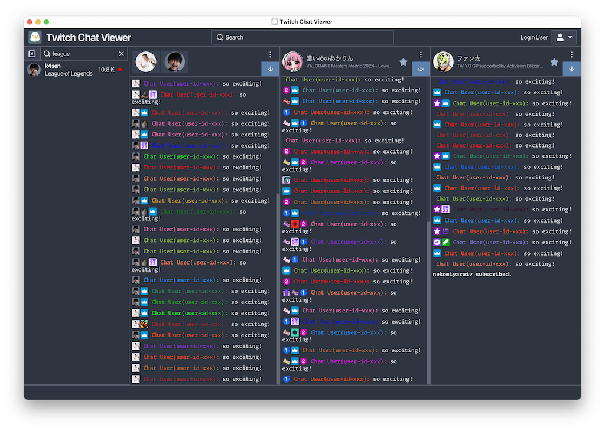

# [k7t3](https://github.com/k7t3) repositories

## [Twitch Chat Viewer](https://github.com/k7t3/TwitchChatViewer)
ライブストリーミングサービス[Twitch](https://www.twitch.tv/)のチャットビューア。

### 主な機能
* マルチチャンネルのチャット閲覧
* チャットのマージ
* チャットビューアのポップアウト
* チャットに投稿されたクリップの検出
* カスタマイズ可能なチャットビューア
* チャットメッセージのフィルタリング

## [Dynamic Table View](https://github.com/k7t3/DynamicTableView)
幅に応じて動的に列数を変更するJavaFXコントロール。

### 主な機能
* VirtualFlowによる効率的な描画
* SelectionModelによる要素の選択ロジック